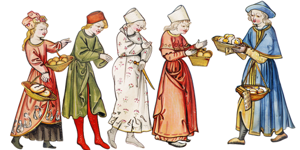

# Searchers of Nottingham



[Searchers of Nottingham](https://dragonfly-xyz.github.io/nottingham-frontend) is an [MEV](https://chain.link/education-hub/maximal-extractable-value-mev)-themed game built on the [Ethereum](https://ethereum.org) Virtual Machine. Players submit compiled smart contracts which represent Merchants at a medieval fair trying to stock their stall with goods (tokens). Merchants face each other in multiple small games. Each round Merchants will try to exchange their gold and goods at the Market (a constant product [AMM](https://chain.link/education-hub/what-is-an-automated-market-maker-amm)). But a Merchant can also choose to bid gold to become the "Sheriff" for that round. The Sheriff chooses the order in which all trades are made and can also make their own trades at will. The first Merchant to acquire the maximum amount of any single good will win!

## Project Setup
Assuming you already have [foundry](https://getfoundry.sh) configured, clone the repo, enter the project folder, then just

```bash
# Install dependencies.
forge install
# Build the project.
forge build
```

## Game Concepts

> ℹ️ You can find the core logic for the game inside [Game.sol](./src/game/Game.sol).

### Game Setup

Each match happens in a fresh instance of the `Game` contract.

1. The `Game` contract will deploy each of the player bytecodes passed in and assign them player indexes in the same order. Players are identified by these (0-based) indices, not their address. Players will not know the address of other players in production.
2. An N-dimensional constant-product [AMM](./src/game/Markets.sol) will be initialized with `N` assets/tokens, where `N` is equal to the number of players in the game. Assets are 18-decimal tokens identified by their (0-based) asset index. Asset `0` is equivalent to the "gold" asset and `1+` are designanted as "goods." This means that there is always one less good than there are players.

### Game Rounds

For every round the following happens:

1. Each player is resupplied, being minted `0.5` units (`0.5e18`) of every goods token and only `1` wei of gold.
2. All players participate in a blind auction for the privilege of building the block for the round.
3. If a player wins the block auction, that player builds the block, settling all bundles and getting their bid burned.
4. If no player wins the block auction, no bundles are settled.
5. If we've played the maximum number of rounds (32) or a player is found to have `32` units (`32e18`) of *any* goods token, the game ends.

When the game ends, players are sorted by their maximum balance of any goods token. This is the final ranking for the match.

### Player Contracts

Players are smart contracts that expose [two callback functions](./src/game/IPlayer.sol):

* `createBundle(uint8 builderIdx) -> PlayerBundle bundle`
    * Returns a `PlayerBundle` for the round, which consists of a sequence of swaps that must be executed by the block builder identified by `builderIdx`.
* `buildBlock(PlayerBundle[] bundles) -> uint256 bid`
    * Receives all bundles created by every player, ordered by player index.
    * Must settle (via `Game.settleBundle()`) all but their own bundles, but in any order.
    * Can directly call swap functions on the `Game` instance (`sell()` or `buy()`).
    * Returns the player's bid (in gold) to build this block. This gold will be burned if they win the block auction.

## Developing and Testing Players

The [`IGame`](./src/game/IGame.sol) interface exposes all functions on the `Game` instance available to players. You should take some time to quickly review it.

The project comes with some [example player contracts](./script/players/). None are particularly sophisticated but will demonstrate typical player behaviors. You can choose to create new contracts in the `players` folder and extend the examples to get started quickly.

### Local Matches
The project comes with a foundry [script](./script/Match.sol) for running matches locally so you can see how well your bot performs against others. Matches can be held against 2 or more player contracts. Note that production tournaments are always conducted with 4 players.

For example, you can run a match against the included example players [`GreedyBuyer`](./script/players/GreedyBuyer.sol) and [`CheapBuyer`](./script/players/CheapBuyer.sol) with the following command:

```bash
forge script Match --sig 'runMatch(string[])' '["GreedyBuyer.sol", "CheapBuyer.sol"]'
```

`runMatch()` assigns players the same player indexes in the same order that player names are passed in. The performance of some of the example players can be biased by their order in a match. You can instead use `runShuffledMatch()` to assign players a random index each run:

```bash
forge script Match --sig 'runShuffledMatch(string[])' '["GreedyBuyer.sol", "CheapBuyer.sol"]'
```

If successful, the output of either command will:
- After each round, print the asset balances of each player.
    - The player that built the block will be prefixed with `(B)`.
- At the end of game, print the final score (max non-gold balance) for each player.

The square brackets (`[x]`) after each player name indicates their assigned player index. The emoji and parenthesis after assets indicate their asset index. Players are always sorted by their highest max good balance.

```bash
  Round 1:
  	   CheapBuyer [1]:
  		0.0 🪙, 0.0 🍅, 0.9295 🥖
  	(B) CheapFrontRunner [0]:
  		0.0 🪙, 0.237 🍅, 0.9285 🥖
  	   GreedyBuyer [2]:
  		0.0 🪙, 0.0 🍅, 0.8885 🥖
# ...
  Round 32:
  	(B) CheapFrontRunner [0]:
  		0.0 🪙, 30.6200 🍅, 0.7229 🥖
  	   GreedyBuyer [2]:
  		0.0 🪙, 0.0 🍅, 29.4251 🥖
  	   CheapBuyer [1]:
  		0.0 🪙, 1.9145 🍅, 0.0 🥖
  🏁 Game ended after 32 rounds:
  	🏆️ CheapFrontRunner [0]: 30.6200 🍅 (1)
  	🥈 GreedyBuyer [2]: 29.4251 🥖 (2)
  	🥉 CheapBuyer [1]: 1.9145 🍅 (1)

```

If you want to see more detail of what went on during a match, you can run the script with full traces on by passing in the `-vvvv` flag. Be warned, this will be a lot of output and can be difficult to read because of how the game logic calls player callbacks repeatedly to simulate them.

>⚠️ Local matches use the foundry scripting engine but the actual tournaments use an isolated, vanilla, Dencun-hardfork environment, so any foundry cheatcodes used by your player contract will fail in production. You should also not count on the `Game` contract being at the same address.